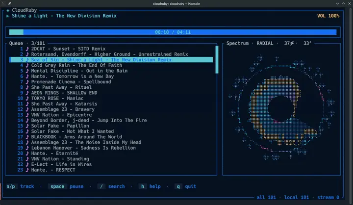

<h1 align="center">CloudRuby</h1>

<p align="center">
 
</p>

<p align="center">
 <a href="https://github.com/kulpae/cloudruby/actions/workflows/rust.yml"></a>
 <a href="https://github.com/kulpae/cloudruby/stargazers"></a>
 <a href="./LICENSE"></a>
</p>

CloudRuby is a terminal music player. It plays audio from local
folders, individual files, M3U/M3U8 playlists, and HTTP(S) streams such as
internet-radio and Icecast stations. The interface is written with Ratatui and
playback uses GStreamer 1.x.

On wide terminals, the right pane shows a live, rotating radial FFT visualization.

## SoundCloud support

SoundCloud support has been dropped because the integration was incompatible
with SoundCloud's API Terms of Use.

## Requirements

- Rust 1.92 or newer
- GStreamer 1.x development files and playback plugins
- A UTF-8 terminal

On Debian or Ubuntu:

```sh
sudo apt install build-essential pkg-config libgstreamer1.0-dev \
  gstreamer1.0-plugins-base gstreamer1.0-plugins-good \
  gstreamer1.0-plugins-bad gstreamer1.0-plugins-ugly
```

On Fedora:

```sh
sudo dnf install gcc pkgconf-pkg-config gstreamer1-devel \
  gstreamer1-plugins-base gstreamer1-plugins-good \
  gstreamer1-plugins-bad-free gstreamer1-plugins-ugly-free
```

On Arch Linux:

```sh
sudo pacman -S base-devel pkgconf gstreamer gst-plugins-base \
  gst-plugins-good gst-plugins-bad gst-plugins-ugly
```

## Build and run

The commands below build CloudRuby from source on Linux. You do not need to
install Rust or Cargo separately: `rustup` installs Rust and includes Cargo,
the Rust build tool. The repository selects the stable toolchain
automatically.

### 1. Install Rust and Cargo

Install `rustup` using the official installer:

```sh
curl --proto '=https' --tlsv1.2 -sSf https://sh.rustup.rs | sh
```

Choose the default installation when prompted. Then load Cargo into the
current terminal session (or close and reopen the terminal):

```sh
source "$HOME/.cargo/env"
```

Check that both tools are available:

```sh
rustc --version
cargo --version
```

### 2. Install system dependencies

Install the GStreamer development files and plugins for your Linux
distribution using one of the commands in [Requirements](#requirements)
if not already installed.

### 3. Download and build CloudRuby

Clone the repository, enter its directory, and compile the optimized release
build:

```sh
git clone https://github.com/kulpae/cloudruby.git
cd cloudruby
cargo build --release
```

The executable is created at `target/release/cloudruby`. You can run it
directly, for example:

```sh
./target/release/cloudruby ~/Music
```

To install the executable into Cargo's user-level binary directory
(`~/.cargo/bin`), run:

```sh
cargo install --path .
```

If `~/.cargo/bin` is on your `PATH`, you can then start CloudRuby from any
directory:

Play every supported audio file below a folder:

```sh
cloudruby ~/Music
```

Play a playlist in its declared order:

```sh
cloudruby --no-shuffle favorites.m3u8
```

Multiple inputs and direct streams can be combined:

```sh
cloudruby --no-shuffle ~/Music radio.m3u \
  https://radio.example.org/live.ogg
```

Sources can also be supplied one per line through standard input:

```sh
printf '%s\n' ~/Music/favorite.mp3 https://radio.example.org/live.ogg | cloudruby --no-shuffle
```

Directory scanning is recursive and recognizes AAC, FLAC, M4A, MP3, OGA, OGG,
Opus, WAV, and WebM files. M3U entries may be absolute paths, paths relative to
the playlist, `file://` URIs, or HTTP(S) URLs. `#EXTINF` titles are displayed when
present.

## Keyboard controls

| Key | Action |
| --- | --- |
| `n` | Play next entry |
| `p` | Play previous entry |
| Down or mouse-wheel down | Select next entry (playback continues) |
| Up or mouse-wheel up | Select previous entry (playback continues) |
| Enter or click a row | Play selected entry |
| Space | Pause or resume |
| `+`, `=`, `*` | Raise volume |
| `-`, `_` | Lower volume |
| `m`, `M` | Toggle mute |
| `s`, `S` | Toggle shuffle |
| `a`, `A` | Add a source while the TUI is open |
| `v`, `V` | Toggle source information |
| `/` | Search track titles; Enter plays the selected result, Esc closes |
| `q`, `Q`, Esc | Quit |

Matching results appear in a search dialog. Selection and playback of the main
queue remain unchanged until you press Enter or click a result.

## Configuration

CloudRuby reads `$XDG_CONFIG_HOME/cloudruby/config.toml`, normally
`~/.config/cloudruby/config.toml`:

```toml
sources = ["~/Music", "/home/me/playlists/radio.m3u8"]
no_shuffle = true

[ui.colors]
title = { fg = "#88c0d0", modifiers = ["bold"] }
playlist_active = { fg = "black", bg = "#88c0d0", modifiers = ["bold"] }
progress_fill = { fg = "#a3be8c", bg = "ansi:236" }
visualizer_low = { fg = "#2f81a8" }
visualizer_mid = { fg = "#88c0d0" }
visualizer_high = { fg = "#b48ead" }
```

Command-line sources replace configured sources for that run. See
[configuration](doc/configuration.md) and [colors](doc/colors.md) for details.

`--no-shuffle` also accepts the legacy forms `--no_shuffle` and
`--no-shuffle=true`.

## Screenshots


## Development

```sh
cargo fmt --all -- --check
cargo clippy --all-targets --all-features -- -D warnings
cargo test --all-targets --all-features
```

## License

See [LICENSE](LICENSE).
